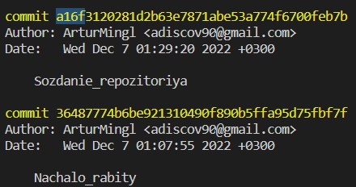
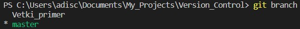

# **Инструкция по работе с Git** #

## **Начало работы** ##

При установке Git первым делом следует указать имя пользователя и адрес электронной почты.

Для этого воспользуйся командами

**git config --global user.name "Artur"**

**git config --global user.email Mingl@example.com**

Чтобы убедиться, что git работает нормально нужно воспльзоваться командой **git --version** 

## **Создание локального репозитория** ##

Для создания локального репозитория требуется:

1. Создать папку
2. Выбрать её в VS Code и с ПКМ открыть во встроенном терминале
3. Ввести команду **git init**

Команда **git init** создаёт файл .git в выбраной папке

Репозиторий создан. Можно проверить его статус с помощью команды **git status**

## **Работа с версиями в локальном репозитории** ##

Для того, чтобы git отслеживал изменения в файле, введи команду **git add _название файла с раширением_**

Теперь, чтобы сохранить изменения в файле (далее *создать коммит*), введи команду **git commit -m "комментарий к коммиту"**

Команда **git log** - позволяет увидеть журнал всех коммитов. У каждого комита есть уникальный номер (нам достаточно знать только первые 4 значения)

Команда **git checkout _номер коммита_** - позволяет переключиться и посмотреть необходимую версию файла

Команда **git checkout master** - переносит к актуальной версии файла

Команда **git diff** - показывает разницу между текущим файлом и последним коммитом. Нажатие **q** позволяет выйти из режима diff 

_В любой непонятной ситуации пробуй нажать **q**_

## **Работа с ветками** ##

## Создание веток

Чтобы увидеть список веток используй команду **git branch**
С помощью **git branch** можно узнать, на какой ветке ты находишься

Команда **git branch _название ветки_** - создаёт новую ветку

Чтобы перейти на новую ветку используй команду **git checkout _название ветки_**

Команда **git checkout -b _название ветки_** позволяет создать ветку и сразу на неё перейти

Теперь команда **git checkout master** будет означать переход на основную ветку

*После того, как ты перешёл на новую ветку коммиты будут относиться только к ней. Т.е. Ветка master отстанет. Если перейти в новую ветку, коммиты, сделанные в старой ветке будут не видны*

## Слияние веток

После того, как в новой ветке файл изменён и закоммичен, можно слить ветки. Для этого нужно перейти в главную ветку с помощью команды **git checkout master** и ввести команду **git merge _название ветки, которую сливаешь_**

Во время слияния могут возникнуть конфликты в строках кода (когда одинаковые строки написаны по разному)

*Попытался создать конфликт. Даже если ветки отличаются git пишет Already up to date и изменения не вносятся. Это что-то новое)*

